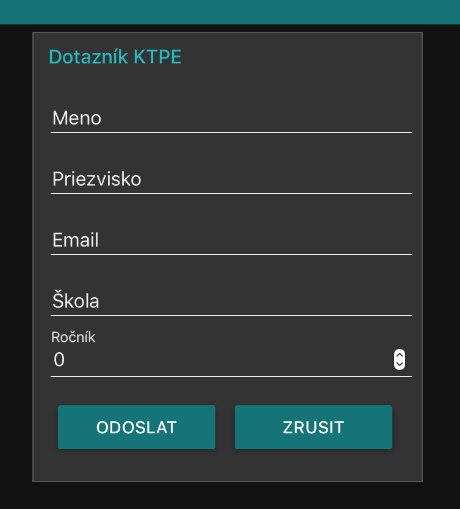
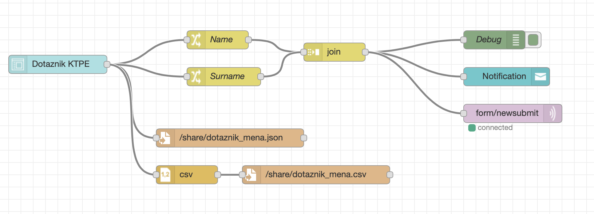

# ThermalPrinter
Simple sketch for bitmap printing without library compatible with Arduino/ESP8266/ESP32

NO LIBRARY image printing for standard ESC/POS printer also known as EPSON script.
This sketch is using just standard Arduino.h library and raw commands described
by ESC/POS® Command Reference
https://reference.epson-biz.com/modules/ref_escpos/index.php?content_id=2
 
Some printers like SparkFun or AdaFruit thermal printers are using newer commands
which should not work on older ESP/POS printers. This is reason why libraries doesnt work
for all printers. This sketch is written for GSerial GP-5890XIII but it should be 
compatible with all ESC/POS printers as it is using only standart and some obsolete commands.

Wiring is simple just connect RX and TX lines between ESP and printer

# ThermalPrinter MQTT
Example of using MQTT protocol for printer control and sending data. This sketch was used in combination with simple questionaire created in node-red dashboard. Once form is filled and submited, datas are stored in local .json and .csv files. Simultantously Name and Surname are posted using MQTT into broker and received by printer After that label with
advert containing Name and surname is printed.

</img>

